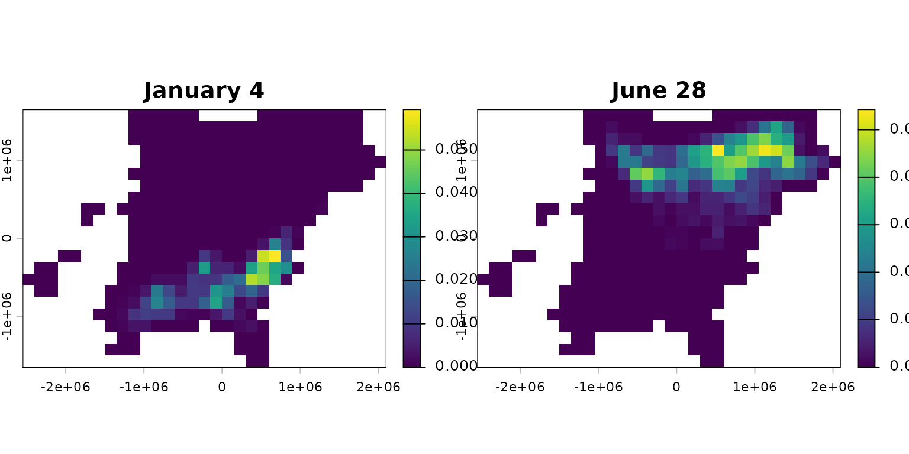
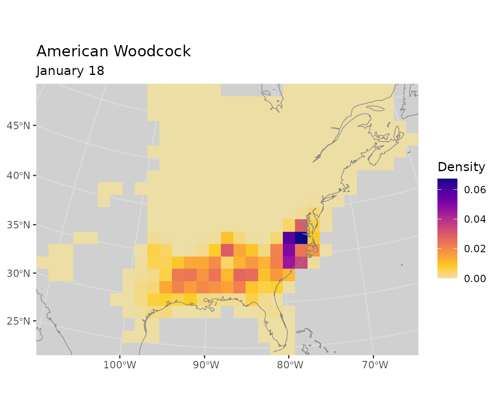
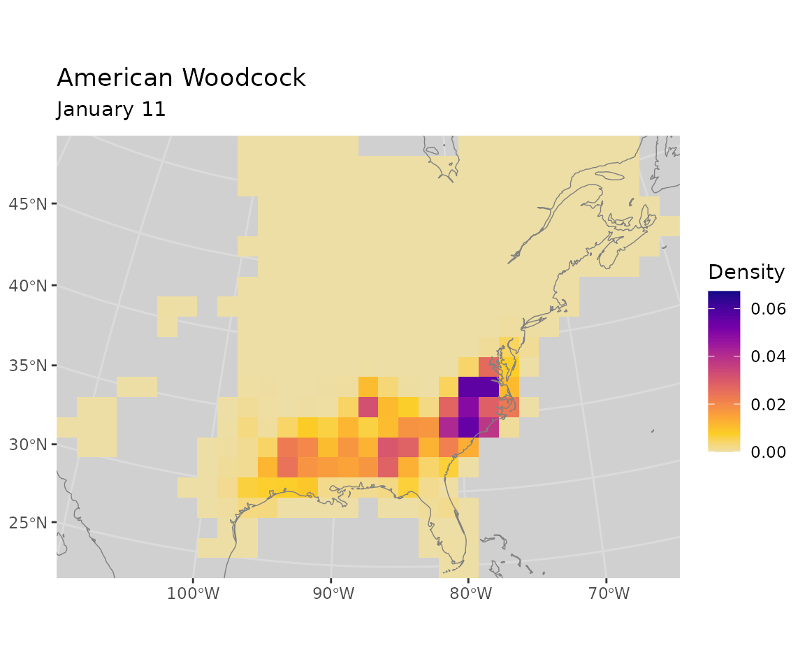
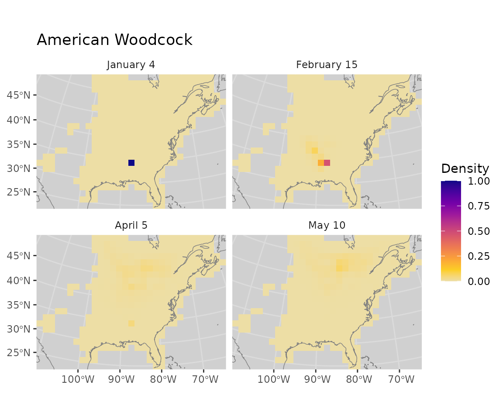
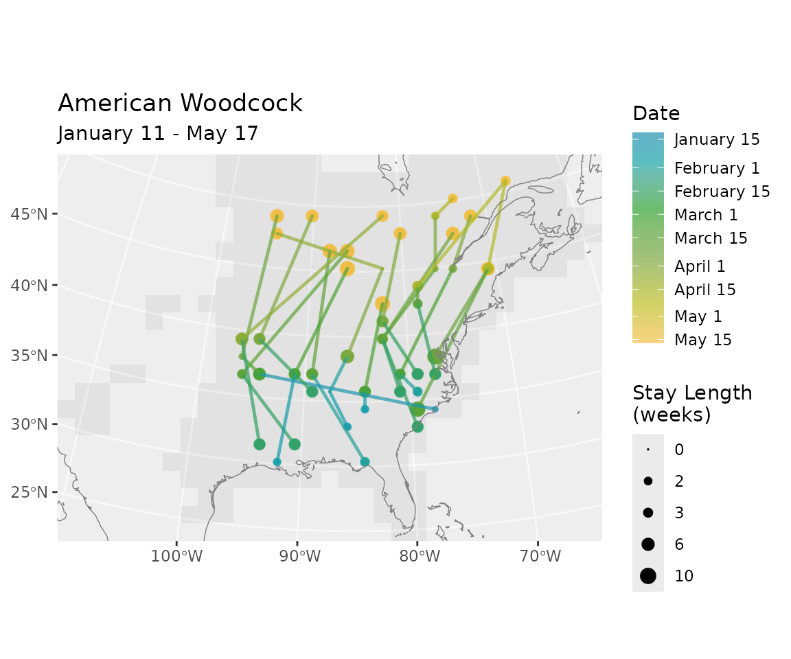
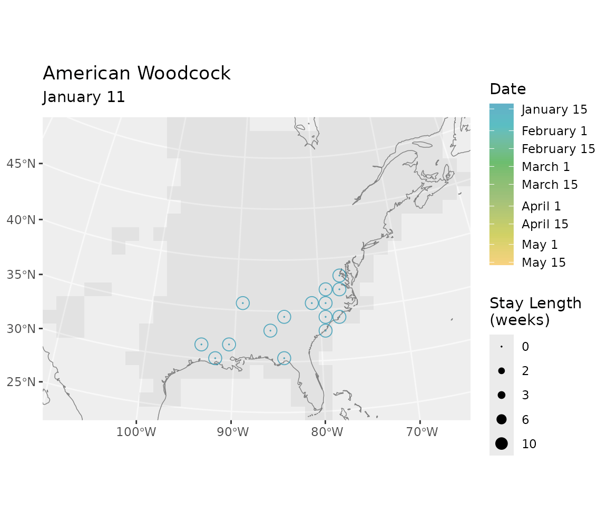

# BirdFlowR

## Setup

### Install packages

``` r

installed <- rownames(installed.packages())
if (!"remotes" %in% installed)
  install.packages("remotes")
if (!"rnaturalearthdata" %in% installed)
  install.packages("rnaturalearthdata")
remotes::install_github("birdflow-science/BirdFlowModels")
remotes::install_github("birdflow-science/BirdFlowR", build_vignettes = TRUE)
```

### Load libraries

``` r

library(BirdFlowModels)
library(BirdFlowR)
library(terra)
#> terra 1.9.27
library(sf)
#> Linking to GEOS 3.12.1, GDAL 3.8.4, PROJ 9.4.0; sf_use_s2() is TRUE
library(ggplot2)
```

### Load model

The BirdFlow Science team has shared a [collection of fitted
models](https://birdflow-science.s3.amazonaws.com/2026/index.html) for
use with the BirdFlowR package; as of mid-2026 the collection includes
60 vetted species. The website includes reports on each species that
include a visualization of the distribution it was trained on and
BirdFlow Migration Traffic Rate (BMTR) derived from the model.

A separate [Avian Influenza
collection](https://birdflow-science.s3.amazonaws.com/avian_flu/index.html)
is also available, providing models used for HPAI spread risk analysis.

We can also access the collection index through the package.

``` r

# Load and print index
index <- load_collection_index()
#> Downloading collection index
head(index[, c("model", "species_code", "common_name")])
#>            model species_code          common_name
#> 1 acafly_best_mo       acafly   Acadian Flycatcher
#> 2 amewoo_best_dg       amewoo    American Woodcock
#> 3 babwar_best_mo       babwar Bay-breasted Warbler
#> 4 balori_best_mo       balori     Baltimore Oriole
#> 5 bkbwar_best_ll       bkbwar Blackburnian Warbler
#> 6 brebla_best_dg       brebla   Brewer's Blackbird
```

And we can load a model from the collection based on the `model` or
`species` columns from the index. **Note:** in the vignette this block
isn’t executed.

``` r

# Load a specific model
bf <- load_model("amewoo") # caches locally and loads from cache
```

This loads the smaller example model instead for efficiency of package
building and testing, but do not use this one for science!

``` r

bf <- BirdFlowModels::amewoo # example and test dataset
```

## Quick demo

Two of the core functions of BirdFlowR are
[`route()`](https://birdflow-science.github.io/BirdFlowR/reference/route.md)
to generate synthetic migration routes and
[`predict()`](https://birdflow-science.github.io/BirdFlowR/reference/predict.BirdFlow.md)
to project birds forward or backward through time.

### Routes

[`route()`](https://birdflow-science.github.io/BirdFlowR/reference/route.md)
generates stochastic migration routes by stepping birds through the
model transitions. Calling it with a `season` argument uses
species-specific dates from eBird to set the time span.

``` r

set.seed(0)
rts <- route(bf, n = 8, season = "prebreeding")
plot(rts, bf)
```


### Forecast

[`predict()`](https://birdflow-science.github.io/BirdFlowR/reference/predict.BirdFlow.md)
propagates a starting distribution forward through time. Here we sample
a single winter location and project it forward to the breeding season.

``` r

set.seed(0)
location <- sample_distr(get_distr(bf, 1))
f <- predict(bf, distr = location, start = 1, end = 26, direction = "forward")
plot_distr(f[, c(1, 7, 14, 19)], bf, dynamic_scale = TRUE)
```


## Time

BirdFlow models represent time as a loop of 52 timesteps (eBird weeks)
with an explicit link from timestep 52 to timestep 1.


BirdFlow’s 52-timestep circular year. Dots mark timesteps / weeks; lines
between them mark transitions. Colors match the seasonal gradient used
by
[`plot_routes()`](https://birdflow-science.github.io/BirdFlowR/reference/plot_routes.md).
The bold line at the Dec/Jan boundary marks the year wrap-around. Season
ranges shown are for American Woodcock.

### Points in time

Most functions that operate over time —
[`get_distr()`](https://birdflow-science.github.io/BirdFlowR/reference/get_distr.md),
[`predict()`](https://birdflow-science.github.io/BirdFlowR/reference/predict.BirdFlow.md),
[`route()`](https://birdflow-science.github.io/BirdFlowR/reference/route.md)
— accept time in any of three forms:

- An **integer timestep** (e.g. `1`, `26`)
- A **character date** in `"YYYY-MM-DD"` format (e.g. `"2022-06-21"`)
- A **`Date` object**

[`lookup_timestep()`](https://birdflow-science.github.io/BirdFlowR/reference/lookup_timestep.md)
converts a date to a timestep integer, and
[`lookup_date()`](https://birdflow-science.github.io/BirdFlowR/reference/lookup_date.md)
does the reverse.

``` r

# Convert a date to a timestep
lookup_timestep("2022-06-20", bf)
#> [1] 25

# Convert a timestep back to a date
lookup_date(25, bf)
#> [1] "2021-06-21"
```

### Sequences through time

[`predict()`](https://birdflow-science.github.io/BirdFlowR/reference/predict.BirdFlow.md),
[`route()`](https://birdflow-science.github.io/BirdFlowR/reference/route.md),
and other functions that involve an arc through time have a common set
of time arguments that are handled by the
[`lookup_timestep_sequence()`](https://birdflow-science.github.io/BirdFlowR/reference/lookup_timestep_sequence.md)
helper.

There are a variety of ways to specify time for these functions:

- `start` and `end` to specify endpoints in any of the ways outlined
  above: timestep integers, character dates e.g. `"2026-01-07"` or
  formal date objects.
- `start` and `n_steps`
- `season` and `season_buffer` — uses season start and end dates from
  eBird and returned by
  [`species_info()`](https://birdflow-science.github.io/BirdFlowR/reference/species_info.md)

With dates (formal or character) the direction in time is explicit, it
will be backwards if the end date is earlier than the start. With all
other inputs it is not explicit and defaults to forward in time. Use
`direction = "backward"` to create a sequence backwards in time with
non-date input.

Here we demonstrate the time input options with
[`lookup_timestep_sequence()`](https://birdflow-science.github.io/BirdFlowR/reference/lookup_timestep_sequence.md).
All of these can also be used with
[`predict()`](https://birdflow-science.github.io/BirdFlowR/reference/predict.BirdFlow.md)
and
[`route()`](https://birdflow-science.github.io/BirdFlowR/reference/route.md).

``` r

# By timestep integers
lookup_timestep_sequence(bf, start = 1, end = 10)
#>  [1]  1  2  3  4  5  6  7  8  9 10

# By character dates or formal date objects (direction is inferred from order)
lookup_timestep_sequence(bf, start = "2022-01-07", end = "2022-03-11")
#>  [1]  1  2  3  4  5  6  7  8  9 10

# By season name (uses species-specific dates from species_info())
# and by default adds a one week buffer around the season.
lookup_timestep_sequence(bf, season = "prebreeding")
#>  [1]  2  3  4  5  6  7  8  9 10 11 12 13 14 15 16 17 18 19 20

# without the buffer
lookup_timestep_sequence(bf, season = "prebreeding", season_buffer = 0)
#>  [1]  3  4  5  6  7  8  9 10 11 12 13 14 15 16 17 18 19

# By start + number of steps
lookup_timestep_sequence(bf, start = 1, n_steps = 9)
#>  [1]  1  2  3  4  5  6  7  8  9 10

# All but the date inputs can also be switched to a backward sequence
lookup_timestep_sequence(bf, season = "prebreeding", direction = "backward")
#>  [1] 20 19 18 17 16 15 14 13 12 11 10  9  8  7  6  5  4  3  2

# Sequence wraps from week 52 to week 1
lookup_timestep_sequence(bf, start = 50, end = 3)
#> [1] 50 51 52  1  2  3
lookup_timestep_sequence(bf, start = 1, end = 45, direction = "backward")
#> [1]  1 52 51 50 49 48 47 46 45
```

## Space

### Distributions

**Distributions** are the standard format for raster data used by
BirdFlow.

Each BirdFlow model has a **static mask** that defines which cells are
*active* — those with non-zero probability in at least one week of the
eBird Status and Trends data the model was trained on. Distributions are
a vector of values corresponding to the active cells in row major order.


BirdFlow distribution data structure: the raster mask selects active
cells, which are stored as a flat vector (one distribution) or matrix
(multiple distributions). Cells in gray are outside of the mask and not
used by BirdFlow models.

Qualities of distributions:

- A single distribution is a numeric vector of length `n_active(bf)`,
  one value per active cell.
- Multiple distributions are stored as a matrix with `n_active(bf)` rows
  and one column per timestep.
- Usually values sum to 1, and each gives the proportion of the
  population in the corresponding cell.
- They are model-specific: each BirdFlow model has its own extent and
  mask, so a distribution from one model cannot be used with another.
- The distribution cannot represent, and the model cannot work with,
  data outside of the static mask.

### Spatial index conversions

The index `i` numbers active cells from 1 to `n_active(bf)`, skipping
masked-out cells (visible in the figure above as the gray shaded cells).
[`i_to_xy()`](https://birdflow-science.github.io/BirdFlowR/reference/index_conversions.md)
and
[`xy_to_i()`](https://birdflow-science.github.io/BirdFlowR/reference/index_conversions.md)
convert between `i` and projected x/y coordinates in the model’s CRS.
[`latlon_to_xy()`](https://birdflow-science.github.io/BirdFlowR/reference/index_conversions.md)
and
[`xy_to_latlon()`](https://birdflow-science.github.io/BirdFlowR/reference/index_conversions.md)
convert between WGS84 latitude/longitude and the model CRS, useful for
bringing in locations from outside data.

``` r

# Coordinates of the first active cell
i_to_xy(1, bf)
#>          x       y
#> 1 -1125000 1575000

# Round-trip: i → xy → i
xy <- i_to_xy(100, bf)
xy_to_i(xy$x, xy$y, bf)  # should return 100
#> [1] 100

# Convert a WGS84 lat/lon to model CRS (Amherst, MA approx.)
latlon_to_xy(lat = 42.4, lon = -72.5, bf)
#>         x        y
#> 1 1032587 432547.1

# Or to i index on the distribution
latlon_to_xy(lat = 42.4, lon = -72.5, bf) |> xy_to_i(bf = bf)
#> [1] 171
```

Not shown above are conversions to row and column indices. See help for
[`i_to_rc()`](https://birdflow-science.github.io/BirdFlowR/reference/index_conversions.md)
or any of the above functions for a complete list of spatial
conversions.

### Retrieve distributions

We can retrieve the eBird distributions the model was trained on with
[`get_distr()`](https://birdflow-science.github.io/BirdFlowR/reference/get_distr.md).
Use timestep, character dates, date objects, or `"all"` to specify which
distributions to retrieve.

Retrieve the first distribution and compare its length to the number of
active cells.

``` r

d <- get_distr(bf, 1) # get first timestep distribution
length(d)  # 1 distribution so d is a vector
#> [1] 342
n_active(bf)  # its length is the number of active cells in the model
#> [1] 342
```

Get 5 distributions. The result is a matrix in which each column is a
distribution with a row for each active cell.

``` r

d <- get_distr(bf, 26:30)
dim(d)
#> [1] 342   5
head(d, 3)
#>       time
#> i      June 28       July 6      July 13 July 20      July 27
#>   [1,]       0 0.000000e+00 0.000000e+00       0 0.000000e+00
#>   [2,]       0 9.342922e-06 8.769396e-05       0 1.607396e-06
#>   [3,]       0 1.499294e-05 4.842432e-05       0 1.748452e-06
```

We can also specify distributions with dates, or use `"all"` to retrieve
all the distributions.

``` r

d <- get_distr(bf, c("2022-12-15", "2022-06-15")) # from character date
d <- get_distr(bf, "all")  # all distributions (this is the default)
d <- get_distr(bf, Sys.Date())  # Using a Date object
```

Use
[`rasterize_distr()`](https://birdflow-science.github.io/BirdFlowR/reference/rasterize.md)
to convert a distribution to a SpatRaster defined in the terra package.
The second argument, the BirdFlow model, is needed for the spatial
information it contains.
[`as_distr()`](https://birdflow-science.github.io/BirdFlowR/reference/as_distr.md)
converts from SpatRaster to a distribution.

``` r

d <- get_distr(bf, c(1, 26)) # winter and summer
r <- rasterize_distr(d, bf) # convert to SpatRaster (terra package)
d2 <- as_distr(r, bf) # Convert a SpatRaster back to a distribution by default this renormalizes so each distribution sums to 1
```

Alternatively, convert directly from BirdFlow to SpatRaster with
[`rast()`](https://rspatial.github.io/terra/reference/rast.html). The
second (optional) argument `which` accepts the same inputs as `which` in
[`get_distr()`](https://birdflow-science.github.io/BirdFlowR/reference/get_distr.md).

``` r

r <- rast(bf) # all distributions
r <- rast(bf, c(1, 26))  # 1st, and 26th timesteps.
plot(r)
```



### Plot distributions

[`plot_distr()`](https://birdflow-science.github.io/BirdFlowR/reference/plot_distr.md)
will make pretty **ggplot2** plots that handle conversion to raster,
overlaying the coastline, and by default shows the static mask.

``` r

get_distr(bf, species_info(bf, "prebreeding_migration_start")) |>
  plot_distr(bf=bf)
```



You can also animate over distributions.

``` r

get_distr(bf, lookup_timestep_sequence(bf, season = "prebreeding")) |>
  animate_distr(bf=bf)
#> `nframes` and `fps` adjusted to match transition
```



## Forecasting

[`predict()`](https://birdflow-science.github.io/BirdFlowR/reference/predict.BirdFlow.md)
is used to project any distribution into the future or past. It shows
where birds in a particular time and location, or set of locations will
be in the future; or were likely to have been previously.

In this example, we will sample a single starting location from the
winter distribution and project it forward to generate a distribution of
predicted breeding grounds for birds that wintered at the starting
location.

Set predict parameters.

``` r

    start <- 1     #  winter
    end <-  26     # summer
```

### Sample starting distribution

[`sample_distr()`](https://birdflow-science.github.io/BirdFlowR/reference/sample_distr.md)
will sample from one or more input distributions to select a single
location per distribution. The result is one or more distributions with
ones in the selected location(s) and zero elsewhere.

``` r

set.seed(0)
d <- get_distr(bf, start)
location <- sample_distr(d)

location_xy <- i_to_xy(which(as.logical(location)), bf)  # starting coordinates
print(location_xy)
#>         x       y
#> 1 -225000 -525000
```

See
[`as_distr()`](https://birdflow-science.github.io/BirdFlowR/reference/as_distr.md)
for additional ways to create the starting distribution.

### Project forward from this location to summer

[`predict()`](https://birdflow-science.github.io/BirdFlowR/reference/predict.BirdFlow.md)
returns the distribution over time as a matrix with one column per
timestep.

The plot shows where birds that winter at a particular location are
likely to be as the year progresses and ultimately where they might
spend their summer. The probability density spreads as the weeks
progress.

``` r

f <- predict(bf, distr = location, start = start, end = end,
             direction = "forward")

plot_distr(f[, c(1, 7, 14, 19)], bf)
```



A single density range is used for all four plots, and the concentrated
density at the start blows out the range. Two options to fix this are to
let the scale be dynamic or to use a log or square root transformation.

**Dynamic scale**

``` r

plot_distr(f[, c(1, 7, 14, 19)], bf, dynamic_scale = TRUE)
```


**Square root transformation**

``` r

plot_distr(f[, c(1, 7, 14, 19)], bf, transform = "sqrt")
```


### Manipulating distributions

Suppose we are interested in how the breeding distribution of birds from
this part of the wintering grounds differs from the overall breeding
distribution. We subtract the whole species distribution from the
projected distribution and plot the difference with
[`plot_distr()`](https://birdflow-science.github.io/BirdFlowR/reference/plot_distr.md).

``` r

projected <- f[, ncol(f)]  # last projected distribution
diff <-  projected - get_distr(bf, end)
pal <- hcl.colors(3, palette = "Fall")

plot_distr(diff, bf, value_label = "Difference") +
    # The scale_fill_gradient2 line is optional, it adds a divergent color scheme centered on zero.
    scale_fill_gradient2(high = pal[1],mid = pal[2], low = pal[3], midpoint = 0, na.value = "transparent") +
    geom_point(aes(x = x, y = y), data = location_xy, inherit.aes = FALSE)
#> Scale for fill is already present.
#> Adding another scale for fill, which will replace the existing scale.
```


## Generating routes

Here we sample locations from the American Woodcock winter distribution
and generate routes to their summer grounds.

Set route parameters.

``` r

n_routes <-  15 # number of routes 
start <- 1         # starting timestep (winter)
end <- 26          # ending timestep (summer)
```

### Generate starting locations

First, extract the winter distribution, then use
[`sample_distr()`](https://birdflow-science.github.io/BirdFlowR/reference/sample_distr.md)
with `n = n_routes` to sample the input distribution repeatedly. The
result is a matrix in which each column has a single ‘1’ representing
the sampled location.

``` r

d <- get_distr(bf, start)
locations  <- sample_distr(d, n = n_routes, bf = bf, format = "xy")
x <- locations$x
y <- locations$y
```

Plot the starting (winter) distribution and sampled locations.

``` r

plot_distr(d, bf) +
  geom_point(aes(x = x, y =y), data = locations, inherit.aes = FALSE, color = "green")
```


### Generate routes

[`route()`](https://birdflow-science.github.io/BirdFlowR/reference/route.md)
will generate synthetic routes for each starting position.
[`route()`](https://birdflow-science.github.io/BirdFlowR/reference/route.md)
returns a `BirdFlowRoutes` object which has a `$data` element with a row
for each timestep of each route, but also includes some additional
spatial, temporal, and species information from the `BirdFlow` object.

``` r

rts <- route(bf, x_coord = x, y_coord = y, start = start, end = end)
head(rts$data, 4)
#>   route_id      x       y   i      lon      lat timestep       date route_type
#> 1        1 675000 -525000 271 -77.7671 34.19035        1 2021-01-04  synthetic
#> 2        1 675000 -525000 271 -77.7671 34.19035        2 2021-01-11  synthetic
#> 3        1 675000 -525000 271 -77.7671 34.19035        3 2021-01-18  synthetic
#> 4        1 675000 -525000 271 -77.7671 34.19035        4 2021-01-25  synthetic
#>   stay_id stay_len
#> 1       1        3
#> 2       1        3
#> 3       1        3
#> 4       1        3
```

If locations are not provided,
[`route()`](https://birdflow-science.github.io/BirdFlowR/reference/route.md)
will sample starting locations from the starting distribution, so the
following is equivalent to the preceding two sections.

``` r

rts2 <- route(bf,  n = n_routes,  start = start, end = end)
```

We can specify the date range with any arguments supported by
[`lookup_timestep_sequence()`](https://birdflow-science.github.io/BirdFlowR/reference/lookup_timestep_sequence.md),
so an alternative to the above with slightly different start and end
dates is to use the season argument. Here, we route during the
prebreeding migration.

``` r

rts3 <- route(bf, n = n_routes, season = "prebreeding")
```

### Plot routes

[`plot()`](https://rspatial.github.io/terra/reference/plot.html) will
visualize `Routes` and `BirdFlowRoutes` objects with time as a color
gradient and stop point dots that indicate how long a bird was at each
location.

``` r

plot(rts3, bf)
```



Routes can also be animated.

``` r

animate_routes(rts3, bf)
```



## Model attributes

### Basic information

[`dim()`](https://birdflow-science.github.io/BirdFlowR/reference/dimensions.md),
[`nrow()`](https://birdflow-science.github.io/BirdFlowR/reference/dimensions.md),
and
[`ncol()`](https://birdflow-science.github.io/BirdFlowR/reference/dimensions.md)
all report on raster dimensions associated with the model. `n_active` is
the count of active cells — those the BirdFlow model can route birds
through — a subset of all cells in the raster.
[`n_transitions()`](https://birdflow-science.github.io/BirdFlowR/reference/dimensions.md)
and
[`n_distr()`](https://birdflow-science.github.io/BirdFlowR/reference/dimensions.md)
report on temporal dimensions. If the model
[`is_cyclical()`](https://birdflow-science.github.io/BirdFlowR/reference/dimensions.md),
they will be equal.

``` r

# Methods for base R functions:
dim(bf)
#> [1] 22 31
c(nrow(bf), ncol(bf))
#> [1] 22 31
bf # same as print(bf)
#> American Woodcock BirdFlow model
#>   dimensions   : 22, 31, 52  (nrow, ncol, ntimesteps)
#>   resolution   : 150000, 150000  (x, y)
#>   active cells : 342
#>   size         : 12.5 Mb

# BirdFlowR functions
n_active(bf)
#> [1] 342
n_transitions(bf)
#> [1] 52
n_timesteps(bf)
#> [1] 52

# Contents
has_marginals(bf)
#> [1] TRUE
has_distr(bf)
#> [1] TRUE
has_transitions(bf)
#> [1] FALSE
is_cyclical(bf)
#> [1] TRUE
```

### Species information

[`species_info()`](https://birdflow-science.github.io/BirdFlowR/reference/species_info.md)
takes a BirdFlow object as the first argument. An optional second
argument allows specifying a specific item; if omitted, a list is
returned with all available information, all of which comes from eBird.

`species(bf)` is a shortcut for `species_info(bf, "common_name")`

Use `?species_info()` to see descriptions of all the available
information. Dates associated with migration and resident seasons are
likely to be useful.

``` r

species(bf)
#> [1] "American Woodcock"
species(bf, "scientific")
#> [1] "Scolopax minor"
species_info(bf, "prebreeding_migration_start")
#> [1] "2021-01-18"
si <-  species_info(bf) # list with all species information
```

### Spatial attributes

BirdFlow models have an inherent raster component and **BirdFlowR** uses
the **terra** package for raster data and provides BirdFlow methods for
terra functions, so you can use them directly on BirdFlow objects.

[`crs()`](https://rspatial.github.io/terra/reference/crs.html) returns
the coordinate reference system — useful if you need to project other
data to match the BirdFlow object.
[`res()`](https://rspatial.github.io/terra/reference/dimensions.html),
[`xres()`](https://rspatial.github.io/terra/reference/dimensions.html),
and
[`yres()`](https://rspatial.github.io/terra/reference/dimensions.html)
describe the dimensions of individual cells.
[`ext()`](https://birdflow-science.github.io/BirdFlowR/reference/dimensions.md)
returns a terra extent object.
[`compareGeom()`](https://birdflow-science.github.io/BirdFlowR/reference/compareGeom-BirdFlow.md)
tests whether two objects share the same CRS, extent, and cell size;
BirdFlowR includes methods to compare BirdFlow models with each other
and with terra objects.
[`compareGeom()`](https://birdflow-science.github.io/BirdFlowR/reference/compareGeom-BirdFlow.md)
does not check for a comparable static mask.

``` r

# Methods for terra functions:
a <- crs(bf) # well known text (long)
crs(bf, proj = TRUE)  # proj4 string
#> [1] "+proj=laea +lat_0=39.161 +lon_0=-85.094 +x_0=0 +y_0=0 +datum=WGS84 +units=m +no_defs"
res(bf)
#> [1] 150000 150000
c(xres(bf), yres(bf)) # same as res(bf)
#> [1] 150000 150000
ext(bf)
#> SpatExtent : -2550000, 2100000, -1650000, 1650000 (xmin, xmax, ymin, ymax)
c(xmin(bf), xmax(bf), ymin(bf), ymax(bf)) # same as ext(bf)
#> [1] -2550000  2100000 -1650000  1650000

# Compare geometries - do they have the same CRS, extent, and cell size
compareGeom(bf, rast(bf))
#> [1] TRUE
```

BirdFlow objects also play nicely with the *sf* package.

``` r

bb <- sf::st_bbox(bf)
crs <- sf::st_crs(bf)
```

### Metadata

The metadata is a mix of information from eBird and BirdFlow. It
includes the eBird version, the BirdFlowR version, the date the model
was fitted, and arguments used while creating the BirdFlow model.

``` r

md <- get_metadata(bf)  # list with all metadata
get_metadata(bf, "birdflow_model_date") # date and time the BirdFlow model was fit
#> [1] "2023-11-21 17:19:27.009766"
get_metadata(bf, "ebird_version_year")  # eBird version year - generally a few years before the data is released
#> [1] 2021
```
