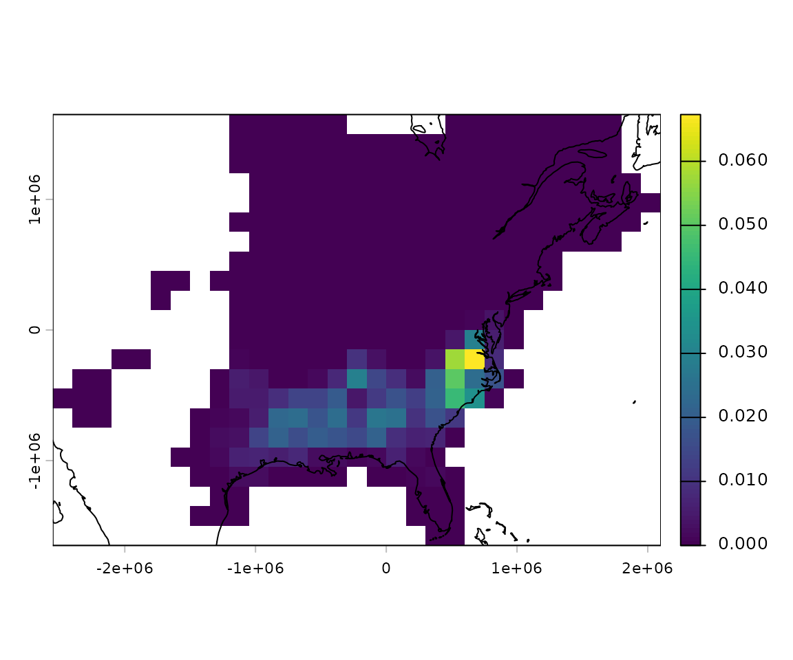

# BirdFlowR

### Setup

#### Install packages

``` r

installed <- rownames(installed.packages())
if (!"remotes" %in% installed)
  install.packages("remotes")
if (!"rnaturalearthdata" %in% installed)
  install.packages("rnaturalearthdata")
remotes::install_github("birdflow-science/BirdFlowModels")
remotes::install_github("birdflow-science/BirdFlowR", build_vignettes = TRUE)
```

#### Load libraries

``` r

library(BirdFlowModels)
library(BirdFlowR)
library(terra)
#> terra 1.9.27
library(sf)
#> Linking to GEOS 3.12.1, GDAL 3.8.4, PROJ 9.4.0; sf_use_s2() is TRUE
```

#### Load model

The BirdFlow Science team has shared a [collection of fitted
models](https://birdflow-science.s3.amazonaws.com/2026/index.html) for
use with the BirdFlowR package. The website includes reports on each
species.

We can also access the collection index through the package.

``` r

# Load and print index
index <- load_collection_index()
#> Downloading collection index
print(index[, c("model", "common_name")])
#>              model                  common_name
#> 1   acafly_best_mo           Acadian Flycatcher
#> 2   amewoo_best_dg            American Woodcock
#> 3   babwar_best_mo         Bay-breasted Warbler
#> 4   balori_best_mo             Baltimore Oriole
#> 5   bkbwar_best_ll         Blackburnian Warbler
#> 6   brebla_best_dg           Brewer's Blackbird
#> 7   brespa_best_dg             Brewer's Sparrow
#> 8   brnthr_best_mo               Brown Thrasher
#> 9   brthum_best_dg     Broad-tailed Hummingbird
#> 10  brwhaw_best_mo            Broad-winged Hawk
#> 11  btbwar_best_dg  Black-throated Blue Warbler
#> 12  btnwar_best_dg Black-throated Green Warbler
#> 13  buggna_best_ll        Blue-gray Gnatcatcher
#> 14  buhvir_best_mo            Blue-headed Vireo
#> 15  bulori_best_dg             Bullock's Oriole
#> 16  buwwar_best_dg          Blue-winged Warbler
#> 17  calhum_best_dg         Calliope Hummingbird
#> 18  camwar_best_dg             Cape May Warbler
#> 19  canwar_best_dg               Canada Warbler
#> 20  casvir_best_mo               Cassin's Vireo
#> 21  cerwar_best_mo             Cerulean Warbler
#> 22  chclon_best_dg   Chestnut-collared Longspur
#> 23  chswar_best_mo       Chestnut-sided Warbler
#> 24  clcspa_best_mo         Clay-colored Sparrow
#> 25  dusfly_best_ll             Dusky Flycatcher
#> 26  easkin_best_mo             Eastern Kingbird
#> 27  gocspa_best_mo       Golden-crowned Sparrow
#> 28  gowwar_best_ll        Golden-winged Warbler
#> 29  graspa_best_mo          Grasshopper Sparrow
#> 30  grycat_best_ll                 Gray Catbird
#> 31  hoowar_best_mo               Hooded Warbler
#> 32  indbun_best_mo               Indigo Bunting
#> 33  kenwar_best_ll             Kentucky Warbler
#> 34  lazbun_best_mo               Lazuli Bunting
#> 35  leafly_best_dg             Least Flycatcher
#> 36  louwat_best_ll        Louisiana Waterthrush
#> 37  macwar_best_mo       MacGillivray's Warbler
#> 38  magwar_best_mo             Magnolia Warbler
#> 39  norpar_best_mo              Northern Parula
#> 40  orcori_best_ll               Orchard Oriole
#> 41  pinwar_best_ll                 Pine Warbler
#> 42  prawar_best_ll              Prairie Warbler
#> 43  prowar_best_mo         Prothonotary Warbler
#> 44  robgro_best_mo       Rose-breasted Grosbeak
#> 45  rthhum_best_mo    Ruby-throated Hummingbird
#> 46  rufhum_best_ll           Rufous Hummingbird
#> 47  sstspa_best_ll            Saltmarsh Sparrow
#> 48  sumtan_best_mo               Summer Tanager
#> 49  swaspa_best_ll                Swamp Sparrow
#> 50  swawar_best_ll           Swainson's Warbler
#> 51  tenwar_best_mo            Tennessee Warbler
#> 52  vesspa_best_ll               Vesper Sparrow
#> 53  virwar_best_dg           Virginia's Warbler
#> 54  wesmea_best_ll           Western Meadowlark
#> 55  westan_best_dg              Western Tanager
#> 56  whtspa_best_mo       White-throated Sparrow
#> 57  wilfly_best_ll            Willow Flycatcher
#> 58 winwre3_best_dg                  Winter Wren
#> 59  woothr_best_dg                  Wood Thrush
#> 60  yebsap_best_mo     Yellow-bellied Sapsucker
```

And we can load a model from the collection based on the `model` column
from the index.  
**Note:** in the vignette this block isn’t executed.

``` r

# Load a specific model
bf <- load_model("amewoo") # caches locally and loads from cache
```

This loads the smaller example model instead for efficiency of package
building and testing, but do not use this one for science!

``` r

bf <- BirdFlowModels::amewoo # example and test dataset
```

### Access basic information

[`dim()`](https://birdflow-science.github.io/BirdFlowR/reference/dimensions.md),
[`nrow()`](https://birdflow-science.github.io/BirdFlowR/reference/dimensions.md),
and
[`ncol()`](https://birdflow-science.github.io/BirdFlowR/reference/dimensions.md)
all report on raster dimensions associated with the model. `n_active` is
the total number of cells that the BirdFlow model can route birds
through and is a subset of the cells in the raster.  
[`n_transitions()`](https://birdflow-science.github.io/BirdFlowR/reference/dimensions.md)
and
[`n_distr()`](https://birdflow-science.github.io/BirdFlowR/reference/dimensions.md)
report on temporal dimensions. If the model
[`is_cyclical()`](https://birdflow-science.github.io/BirdFlowR/reference/dimensions.md),
they will be equal.

``` r

# Methods for base R functions:
dim(bf)
#> [1] 22 31
c(nrow(bf), ncol(bf))
#> [1] 22 31
bf # same as print(bf)
#> American Woodcock BirdFlow model
#>   dimensions   : 22, 31, 52  (nrow, ncol, ntimesteps)
#>   resolution   : 150000, 150000  (x, y)
#>   active cells : 342
#>   size         : 12.5 Mb

# BirdFlowR functions
n_active(bf)
#> [1] 342
n_transitions(bf)
#> [1] 52
n_timesteps(bf)
#> [1] 52

# Contents
has_marginals(bf)
#> [1] TRUE
has_distr(bf)
#> [1] TRUE
has_transitions(bf)
#> [1] FALSE
is_cyclical(bf)
#> [1] TRUE
```

### Species information and metadata

[`species_info()`](https://birdflow-science.github.io/BirdFlowR/reference/species_info.md)
and
[`get_metadata()`](https://birdflow-science.github.io/BirdFlowR/reference/get_metadata.md)
take a BirdFlow object as their first argument. An optional second
argument allows specifying a specific item, if omitted a list is
returned with all the available information.

`species(bf)` is a shortcut for `species_info(bf, "common_name")`

Use `?species_info()` to see descriptions of all the available
information. Dates associated with migration and resident seasons are
likely to be useful.

``` r

species(bf)
#> [1] "American Woodcock"
species(bf, "scientific")
#> [1] "Scolopax minor"
species_info(bf, "prebreeding_migration_start")
#> [1] "2021-01-18"
si <-  species_info(bf) # list with all species information
md <- get_metadata(bf)  # list with all metadata
get_metadata(bf, "birdflow_model_date") # date model was exported from python
#> [1] "2023-11-21 17:19:27.009766"

validate_BirdFlow(bf)  # throws error if there are problems
```

### Spatial aspects

BirdFlow models are based on a raster representation of a time series of
species distributions and contain all the spatial information necessary
to recreate those distributions and to define how the raster is
positioned in space. BirdFlowR uses the **terra** package to import
raster data and provides BirdFlow methods for functions defined in the
terra package - so that you can use those functions on BirdFlow objects.

[`crs()`](https://rspatial.github.io/terra/reference/crs.html) returns
the coordinate reference system - useful if you need to project other
data to match the BirdFlow object.
[`res()`](https://rspatial.github.io/terra/reference/dimensions.html),
[`xres()`](https://rspatial.github.io/terra/reference/dimensions.html),
and
[`yres()`](https://rspatial.github.io/terra/reference/dimensions.html)
describe the dimensions of individual cells in the model.
[`ext()`](https://birdflow-science.github.io/BirdFlowR/reference/dimensions.md)
returns a terra extent object.  
`compare_geom()` tests if the extent, resolution, and CRS of two objects
is the same. BirdFlowR includes methods to compare BirdFlow models with
each other and with terra objects.

``` r

# Methods for terra functions:
a <- crs(bf) # well known text (long)
crs(bf, proj = TRUE)  # proj4 string
#> [1] "+proj=laea +lat_0=39.161 +lon_0=-85.094 +x_0=0 +y_0=0 +datum=WGS84 +units=m +no_defs"
res(bf)
#> [1] 150000 150000
c(xres(bf), yres(bf)) # same as res(bf)
#> [1] 150000 150000
ext(bf)
#> SpatExtent : -2550000, 2100000, -1650000, 1650000 (xmin, xmax, ymin, ymax)
c(xmin(bf), xmax(bf), ymin(bf), ymax(bf)) # same as ext(bf)
#> [1] -2550000  2100000 -1650000  1650000

# Compare geometries - do they have the same CRS, extent, and cell size
compareGeom(bf, rast(bf))
#> [1] TRUE
```

BirdFlow objects also play nicely with the *sf* package.

``` r

bb <- sf::st_bbox(bf)
crs <- sf::st_crs(bf)
```

### Retrieve and plot distributions

A distribution in BirdFlow is stored as a vector of values that
correspond to only the active cells
([`n_active()`](https://birdflow-science.github.io/BirdFlowR/reference/dimensions.md))
in the model. Multiple distributions are stored as matrices with
[`n_active()`](https://birdflow-science.github.io/BirdFlowR/reference/dimensions.md)
rows and a column for each distribution.

We can retrieve distributions in this format with
[`get_distr()`](https://birdflow-science.github.io/BirdFlowR/reference/get_distr.md).
Use timestep, character dates, date objects, or “all” to specify which
distributions to retrieve.

Retrieve the first distribution and compare its length to the number of
active cells.

``` r

d <- get_distr(bf, 1) # get first timestep distribution
length(d)  # 1 distribution so d is a vector
#> [1] 342
n_active(bf)  # its length is the the number of active cells in the model
#> [1] 342
```

Get 5 distributions, the result is a matrix in which each column is a
distribution with a row for each active cell.

``` r

d <- get_distr(bf, 26:30)
dim(d)
#> [1] 342   5
head(d, 3)
#>       time
#> i      June 28       July 6      July 13 July 20      July 27
#>   [1,]       0 0.000000e+00 0.000000e+00       0 0.000000e+00
#>   [2,]       0 9.342922e-06 8.769396e-05       0 1.607396e-06
#>   [3,]       0 1.499294e-05 4.842432e-05       0 1.748452e-06
```

We can also specify distributions with dates, or use “all” to retrieve
all the distributions.

``` r

d <- get_distr(bf, "2022-12-15") # from character date
d <- get_distr(bf, "all")  # all distributions
d <- get_distr(bf, Sys.Date())  # Using a Date object
```

Use
[`rasterize_distr()`](https://birdflow-science.github.io/BirdFlowR/reference/rasterize.md)
to convert a distribution to a SpatRaster defined in the terra package.
The second argument, the BirdFlow model, is needed for the spatial
information it contains.

``` r

d <- get_distr(bf, c(1, 26)) # winter and summer
r <- rasterize_distr(d, bf) # convert to SpatRaster
```

Alternatively convert directly from BirdFlow to SpatRaster with
[`rast()`](https://rspatial.github.io/terra/reference/rast.html). The
second (optional) argument `which` accepts the same inputs as `which` in
[`get_distr()`](https://birdflow-science.github.io/BirdFlowR/reference/get_distr.md).

``` r

r <- rast(bf) # all distributions
r <- rast(bf, c(1, 26))  # 1st, and 26th timesteps.
plot(r)
```


BirdFlowR provides convenience wrappers to functions in
**rnaturalearth** that load vector data and then crop and transform it
to make it suitable for plotting with BirdFlow output.

***Note:** until **rnaturalearth** has fully transitioned away from
legacy packages you may see a warning about them, but **BirdFlowR** does
not use the legacy packages or data formats itself.*

``` r

r <- rast(bf, species_info(bf, "prebreeding_migration_start"))
plot(r)
coast <- get_coastline(bf)  # lines
plot(coast, add = TRUE)
```



## Forecasting

In this section we will sample a single starting location from the
winter distribution and project it forward. We will generate a
distribution of predicted breeding grounds for birds that wintered at
the starting location.

Set predict parameters.

``` r

    start <- 1     #  winter
    end <-  26     # summer
```

### Sample starting distribution

[`sample_distr()`](https://birdflow-science.github.io/BirdFlowR/reference/sample_distr.md)
will sample from one or more input distribution to select a single
location per distribution. The result is one or more distributions with
ones in the selected location(s) and zero elsewhere.

``` r

set.seed(0)
d <- get_distr(bf, start)
location <- sample_distr(d)

print(i_to_xy(which(as.logical(location)), bf))  # starting coordinates
#>         x       y
#> 1 -225000 -525000
```

### Project forward from this location to summer

[`predict()`](https://birdflow-science.github.io/BirdFlowR/reference/predict.BirdFlow.md)
returns the distribution over time as a matrix with one column per
timestep.

The plot shows where birds that winter at a particular location are
likely to be as the year progresses and ultimately where they might
spend their summer. The probability density spreads as the weeks
progress.

``` r

f <- predict(bf, distr = location, start = start, end = end,
             direction = "forward")

r <- rasterize_distr(f[, c(1, 7, 14, 19)], bf)
plot(r)
```


Additionally, we can calculate the difference between the projected
distribution and the distribution of the species as a whole at the same
timestep.

``` r

projected <- f[, ncol(f)]  # last projected distribution
diff <-  projected - get_distr(bf, end)
plot(rasterize_distr(diff, bf))
```


## Generate synthetic routes

Here we sample locations from the American Woodcock winter distribution
and generate routes to their summer grounds.

Set route parameters.

``` r

n_positions <-  15 # number of starting positions
start <- 1         # starting timestep (winter)
end <- 26          # ending timestep (summer)
```

### Generate starting locations

First extract the winter distribution, then use `sample_locations()`
with `n = n_positions` to sample the input distribution repeatedly. The
result is a matrix in which each column has a single ‘1’ representing
the sampled location.

``` r

d <- get_distr(bf, start)
locations  <- sample_distr(d, n = n_positions, bf = bf, format = "xy")
x <- locations$x
y <- locations$y
```

Plot the starting (winter) distribution and sampled locations.

``` r

winter <- rasterize_distr(d, bf)
plot(winter)
points(x, y)
```


### Generate routes

[`route()`](https://birdflow-science.github.io/BirdFlowR/reference/route.md)
will generate synthetic routes for each starting position.
[`route()`](https://birdflow-science.github.io/BirdFlowR/reference/route.md)
returns a `BirdFlowRoutes` object which has a `$data` element with a row
for each timestep of each route, but also includes some additional
spatial, temporal, and species information from the `BirdFlow` object.

``` r

rts <- route(bf, x_coord = x, y_coord = y, start = start, end = end)
head(rts$data, 4)
#>   route_id      x       y   i      lon      lat timestep       date route_type
#> 1        1 675000 -525000 271 -77.7671 34.19035        1 2021-01-04  synthetic
#> 2        1 675000 -525000 271 -77.7671 34.19035        2 2021-01-11  synthetic
#> 3        1 675000 -525000 271 -77.7671 34.19035        3 2021-01-18  synthetic
#> 4        1 675000 -525000 271 -77.7671 34.19035        4 2021-01-25  synthetic
#>   stay_id stay_len
#> 1       1        3
#> 2       1        3
#> 3       1        3
#> 4       1        3
```

The
[`route()`](https://birdflow-science.github.io/BirdFlowR/reference/route.md)
function can sample starting locations from the distribution for the
starting timestep so the following is equivalent to the preceding two
sections.

``` r

rts2 <- route(bf,  n = n_positions,  start = start, end = end)
```

We can specify the date range with any arguments supported by
[`lookup_timestep_sequence()`](https://birdflow-science.github.io/BirdFlowR/reference/lookup_timestep_sequence.md)
so an alternative to the above with slightly different start and end
dates is to use the season argument. Here we route during the
prebreeding migration.

``` r

rts3 <- route(bf, n = n_positions, season = "prebreeding")
```

### Using base R plotting to plot routes

Plot the route lines over the summer distribution along with points at
the starting and ending positions.

``` r

d <- get_distr(bf, end)
summer <- rasterize_distr(d, bf)

line_col <- rgb(0, 0, 0, .2)
pt_col <- rgb(0, 0, 0, .5)

plot(summer)
points(x, y, cex = .4, col = pt_col, pch = 16) # starting points

rts_sf <- sf::st_as_sf(rts$data, coords = c("x", "y"), crs = rts$geom$crs)
lines_sf <- rts_sf |>
  dplyr::group_by(route_id) |>
  dplyr::summarize(geometry = st_combine(geometry)) |>
  sf::st_cast("LINESTRING")

plot(lines_sf, add = TRUE, col = line_col)  # routes

end_pts <- rts$data[rts$data$timestep == end, ]  # end points
points(x = end_pts$x, y = end_pts$y,
       cex = 0.4, pch = 12, col = pt_col)

title(main = species(bf))
```


### Or use the plot() method

[`plot()`](https://rspatial.github.io/terra/reference/plot.html) will
visualize `Routes` and `BirdFlowRoutes` objects with time as a color
gradient and stop point dots that indicate how long a bird was at each
location.

``` r

plot(rts, bf)
```


