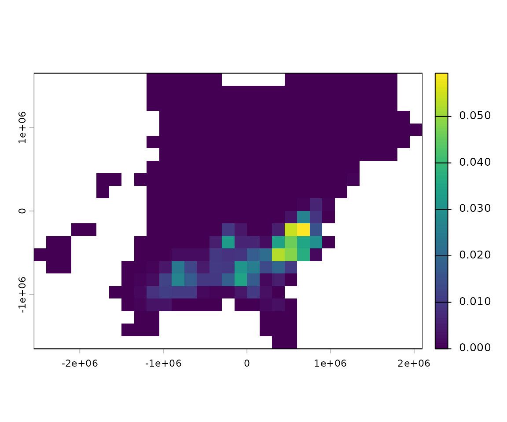

# Detailed installation instructions

## Standard install

This uses R and RStudio installed directly on your system if you have
both of those installed skip to step 3.

1.  [Install R from CRAN](https://cran.r-project.org/) - follow links
    for your system in the upper right. I’m currently using R version
    4.5.2 (2025-10-31) but I think any 4.2.x and above should work.

2.  [Install RStudio IDE](https://posit.co/download/rstudio-desktop/)
    This isn’t strictly necessary, but RStudio is a significant upgrade
    to R’s standard GUI.

3.  Install required R packages. Open RStudio and run the following in
    the console.

    ``` r
    installed <- rownames(installed.packages())
    if (!"remotes" %in% installed)
      install.packages("remotes")
    if (!"rnaturalearthdata" %in% installed)
      install.packages("rnaturalearthdata")
    remotes::install_github("birdflow-science/BirdFlowModels")
    remotes::install_github("birdflow-science/BirdFlowR", build_vignettes = TRUE)
    ```

    Package dependencies can be a pain. If the above doesn’t work you
    can also try the alternative method below, also executed in the
    RStudio console.

    ``` r
    installed <- rownames(installed.packages())
    if (!"pak" %in% installed)
      install.packages("pak")

    pak::pkg_install("rnaturalearthdata", ask = FALSE)
    pak::pkg_install("birdflow-science/BirdFlowModels", ask = FALSE, )
    pak::pkg_install("birdflow-science/BirdFlowR", ask = FALSE,
                     dependencies = TRUE)
    ```

    If neither of those methods work a last option to try with specific
    troublesome packages is to use RStudio’s “Install Packages” from the
    top of the “Tools” menu.

## Docker

Alternatively you can install from a Dockerfile

Here’s how one can use the Dockerfile in Linux/MacOS (Windows should be
similar).

1.  Download and install [Docker
    Desktop](https://www.docker.com/products/docker-desktop/).

2.  If your computer has an Apple Silicon chip (e.g., M1 or M2), in
    Docker Desktop go to Settings \> General and ensure “Use
    Virtualization Framework” is checked, then go to Features in
    Development \> and check “Use Rosetta for x86/amd64 emulation on
    Apple Silicon”. Apply these settings and restart Docker Desktop as
    needed.

3.  Ensure that Docker Desktop is running.

4.  Clone the [BirdFlowR
    package](https://github.com/birdflow-science/BirdFlowR) from GitHub.

5.  Go to the top level BirdFlowR directory, build the image from the
    Dockerfile, and tag the image as ‘birdflow’. It will take a long
    time the first time because it will need to download the
    rocker/geospatial: image from Docker Hub, which is the starting
    point before we install our custom packages via the Dockerfile. For
    future builds on the same machine, rocker/geospatial will already be
    cached by Docker, so all it needs to do to is re-install our custom
    packages. The build step really only needs to happen when you want
    to use a newer version of the BirdFlowR repo. See also the [Rocker
    RStudio
    images](https://rocker-project.org/images/versioned/rstudio.html).

    ``` bash
    cd ~/BirdFlowR
    docker build -t birdflow . --no-cache
    ```

6.  Launch a Docker container from the image, and launch an RStudio
    Server instance from the container. If you’re doing it locally on
    your computer, you can use this version to skip the password.
    Specifying the IP address in this way should make it only accessible
    from the same computer, according to the Rocker page.

    ``` bash
    docker run --platform linux/amd64 --rm -ti -e DISABLE_AUTH=true -p 127.0.0.1:8787:8787 birdflow
    ```

    If you’re doing it between computers, make sure to only include the
    ports, and require authentication:

    ``` bash
    docker run --platform linux/amd64 --rm -ti -e PASSWORD=yourpassword -p 8787:8787 birdflow
    ```

7.  Once you see the message saying services are started, point your web
    browser to [localhost:8787/](localhost:8787/) to use RStudio from
    the image.

8.  When you’re done, go back to the terminal window that started the
    docker services, and hit Control-C. This will send a kill signal to
    the container that is supporting the RStudio server process.

9.  The Rocker webpage shows some ways to persist directories and
    settings between the container and host as well, so that you don’t
    lose your RStudio settings and local work each time you launch/close
    a container.

## ebirdst

If you want to preprocess species for model fitting you will need an
[ebirdst](https://ebird.github.io/ebirdst/) access code that you must
request [via an online form](https://ebird.org/st/request).

Once you have the code you should run (in the R or RStudio console):

``` r
library(ebirdst)
set_ebirdst_access_key("XXXXX")
```

where “XXXXX” is the access key.

Then restart R.

## Test

Run these lines to see see if you’ve installed the two BirdFlow packages
and their dependencies.

``` r
library(BirdFlowModels)
library(BirdFlowR)
library(terra)
bf <- BirdFlowModels::amewoo
print(bf)
plot(rast(bf, 1))
```



    #> American Woodcock BirdFlow model
    #>   dimensions   : 22, 31, 52  (nrow, ncol, ntimesteps)
    #>   resolution   : 150000, 150000  (x, y)
    #>   active cells : 342
    #>   size         : 12.5 Mb
