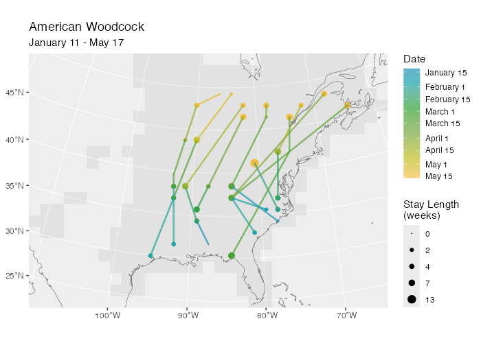
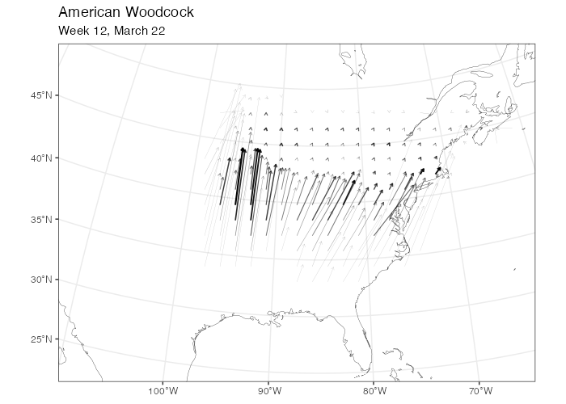

# BirdFlowR

An R package to predict changes in bird distributions and generate
synthetic migration routes based on BirdFlow models.

This package is under development and not yet formally released.
Function names and arguments may change.

## Installation

Install just the package:

``` r
if(!require("remotes"))
  install.packages("remotes") 
remotes::install_github("birdflow-science/BirdFlowR")
```

Or to install with example data and vignette:

``` r
installed <- rownames(installed.packages())
if(!"remotes" %in% installed)
  install.packages("remotes")
if(!"rnaturalearthdata" %in% installed)
  install.packages("rnaturalearthdata")
remotes::install_github("birdflow-science/BirdFlowModels")
remotes::install_github("birdflow-science/BirdFlowR", build_vignettes = TRUE)
```

See
[`vignette("Installation")`](https://birdflow-science.github.io/BirdFlowR/articles/Installation.md)
for troubleshooting and more installation options.

## Usage

The two primary functions are
[`predict()`](https://birdflow-science.github.io/BirdFlowR/reference/predict.BirdFlow.md)
to project distributions and
[`route()`](https://birdflow-science.github.io/BirdFlowR/reference/route.md)
to generate synthetic routes.

[`route_migration()`](https://birdflow-science.github.io/BirdFlowR/reference/route_migration.md)
is a wrapper to
[`route()`](https://birdflow-science.github.io/BirdFlowR/reference/route.md)
which automates sampling locations from the a distribution for the start
of the migration and setting the start and end dates to route for the
migration window. We can use it to create synthetic routes for a
species.

``` r
library(BirdFlowR)
library(BirdFlowModels)

bf <- amewoo 

species(bf)
#> [1] "American Woodcock"

# Generate routes for the prebreeding migration 
rts <- route(bf, n = 10, season = "prebreeding")

# Plot routes
plot_routes(rts, bf)
```



Visualize the movement in the BirdFlow model for a timestep.

``` r

plot_movement_vectors(bf, start = 12)
```



## Learn more

- [`vignette("BirdFlowR")`](https://birdflow-science.github.io/BirdFlowR/articles/BirdFlowR.md)
  has a longer introduction to the package, and how to use
  [`predict()`](https://birdflow-science.github.io/BirdFlowR/reference/predict.BirdFlow.md)
  and
  [`route()`](https://birdflow-science.github.io/BirdFlowR/reference/route.md)
  to project bird distributions and movement.
- [`vignette("Installation")`](https://birdflow-science.github.io/BirdFlowR/articles/Installation.md)
  for detailed installation instructions.
- [`vignette("Preprocess")`](https://birdflow-science.github.io/BirdFlowR/articles/Preprocess.md)
  covers downloading and formatting data for model fitting with
  [`preprocess_species()`](https://birdflow-science.github.io/BirdFlowR/reference/preprocess_species.md),
  importing fitted models with
  [`import_birdflow()`](https://birdflow-science.github.io/BirdFlowR/reference/export_import_birdflow.md),
  and reducing model size with
  [`sparsify()`](https://birdflow-science.github.io/BirdFlowR/reference/sparsify.md).  
- Read the paper:
  - [BirdFlow: Learning Seasonal Bird Movements from Citizen Science
    Data](https://www.biorxiv.org/content/10.1101/2022.04.12.488057v1)
    Miguel Fuentes, Benjamin M. Van Doren, Daniel Fink, Daniel Sheldon
    bioRxiv 2022.04.12.488057; doi:
    <https://doi.org/10.1101/2022.04.12.488057>
