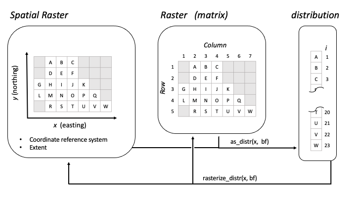

```{r, include = FALSE}
knitr::opts_chunk$set(
  collapse = TRUE,
  comment = "#>",
  out.width = "65%",
  fig.width = 6,
  fig.height = 5
)
```

## Setup

### Install packages
```{r install, eval = FALSE }
installed <- rownames(installed.packages())
if (!"remotes" %in% installed)
  install.packages("remotes")
if (!"rnaturalearthdata" %in% installed)
  install.packages("rnaturalearthdata")
remotes::install_github("birdflow-science/BirdFlowModels")
remotes::install_github("birdflow-science/BirdFlowR", build_vignettes = TRUE)
```

### Load libraries
```{r setup}
library(BirdFlowModels)
library(BirdFlowR)
library(terra)
library(sf)
library(ggplot2)
```


### Load model

The BirdFlow Science team has shared a 
[collection of fitted models](`r paste0(birdflow_options("collection_url"), "index.html")`) for use with
the BirdFlowR package; as of mid-2026 the collection includes 60 vetted species. 
The website includes reports on each species that includes a visualization of the
distribution it was trained on and Bird Flow Migration Traffic (BMTR) derived from the model
<!-- TODO: Once URL is confirmed, add: "A separate [Avian Influenza collection](URL) is also available, providing models used for HPAI spread risk analysis." -->

We can also access the collection index through the package.

```{r load index}
# Load and print index
index <- load_collection_index()
print(index[, c("model", "common_name")])
```

And we can load a model from the collection based on the `model` or `species` columns from 
the index.  
**Note:** in the vignette this block isn't executed.

```{r load model, eval = FALSE}
# Load a specific model
bf <- load_model("amewoo") # caches locally and loads from cache
```
This loads the smaller example model instead for efficiency of package building
and testing, but do not use this one for science!
```{r load example model, eval = TRUE}
bf <- BirdFlowModels::amewoo # example and test dataset
```

## Access basic information 

`dim()`, `nrow()`, and `ncol()` all report on raster dimensions associated with the model.
`n_active` is the total number of cells that the BirdFlow model can route birds through and is a subset of the cells in the raster.  
`n_transitions()` and `n_distr()` report on temporal dimensions. If the model `is_cyclical()`, they will be equal.

```{r access}
# Methods for base R functions:
dim(bf)
c(nrow(bf), ncol(bf))
bf # same as print(bf)

# BirdFlowR functions
n_active(bf)
n_transitions(bf)
n_timesteps(bf)

# Contents
has_marginals(bf)
has_distr(bf)
has_transitions(bf)
is_cyclical(bf)
```

## Species information and metadata
`species_info()` and `get_metadata()` take a BirdFlow object as their first argument.
An optional second argument allows specifying a specific item, if omitted a list is returned with all the available information.

`species(bf)` is a shortcut for `species_info(bf, "common_name")`

Use `?species_info()` to see descriptions of all the available information.
Dates associated with migration and resident seasons are likely to be useful.

```{r BirdFlow specific info}
species(bf)
species(bf, "scientific")
species_info(bf, "prebreeding_migration_start")
si <-  species_info(bf) # list with all species information
md <- get_metadata(bf)  # list with all metadata
get_metadata(bf, "birdflow_model_date") # date model was exported from python

validate_BirdFlow(bf)  # throws error if there are problems
```
## Spatial aspects

BirdFlow models are based on a raster representation of a time series of species
distributions and contain all the spatial information necessary to recreate 
those distributions and to define how the raster is positioned in space.
BirdFlowR uses the **terra** package to import raster data and provides BirdFlow 
methods for functions defined in the terra package - so that you can use those 
functions on BirdFlow objects.

`crs()` returns the coordinate reference system - useful if you need to project other data to match the BirdFlow object.
`res()`, `xres()`, and `yres()` describe the dimensions of individual cells in the model.
`ext()` returns a terra extent object.  
`compare_geom()` tests if the extent, resolution, and CRS of two objects is the
same. BirdFlowR includes methods to compare BirdFlow models with each other and
with terra objects.

```{r spatial aspects terra}
# Methods for terra functions:
a <- crs(bf) # well known text (long)
crs(bf, proj = TRUE)  # proj4 string
res(bf)
c(xres(bf), yres(bf)) # same as res(bf)
ext(bf)
c(xmin(bf), xmax(bf), ymin(bf), ymax(bf)) # same as ext(bf)

# Compare geometries - do they have the same CRS, extent, and cell size
compareGeom(bf, rast(bf))
```

BirdFlow objects also play nicely with the *sf* package.

```{r sf}
bb <- sf::st_bbox(bf)
crs <- sf::st_crs(bf)
```

### Spatial index conversions

BirdFlow models represent the species range as a raster, but only cells within
the modeled range are active.
The index `i` numbers these active cells from 1 to `n_active(bf)`, skipping
all masked-out cells.
This is a fundamental spatial data structure used by BirdFlowR: a distribution is a vector
of length `n_active(bf)` with one value per active cell.  Importantly, 
a distribution is tied to a single BirdFlow model as each model will likely have
a different extent and mask.  

`i_to_xy()` and `xy_to_i()` convert between the `i` index and projected x/y
coordinates in the model's CRS.
`latlon_to_xy()` and `xy_to_latlon()` convert between WGS84 latitude/longitude
and the model CRS, which is useful for specifying locations from outside data.

```{r spatial index conversions}
# Coordinates of the first active cell
i_to_xy(1, bf)

# Round-trip: i → xy → i
xy <- i_to_xy(100, bf)
xy_to_i(xy$x, xy$y, bf)  # should return 100

# Convert a WGS84 lat/lon to model CRS (Amherst, MA approx.)
latlon_to_xy(lat = 42.4, lon = -72.5, bf)

# Or to i index on the distribution
latlon_to_xy(lat = 42.4, lon = -72.5, bf) |> xy_to_i(bf = bf)


```

## Specifying Time

BirdFlow models represent time as a sequence of discrete timesteps, typically
one per week.
Most functions that operate over time — `get_distr()`, `predict()`, `route()`
— accept time in any of three forms:

- An **integer timestep** (e.g. `1`, `26`)
- A **character date** in `"YYYY-MM-DD"` format (e.g. `"2022-06-21"`)
- A **`Date` object**

`lookup_timestep()` converts a date to a timestep integer, and `lookup_date()`
does the reverse.

```{r lookup_timestep and lookup_date}
# Convert a date to a timestep
lookup_timestep("2022-06-20", bf)

# Convert a timestep back to a date
lookup_date(25, bf)

```

The functions `predict()`, `route()`, and others accept a `start` and `end`
argument that are forwarded to `lookup_timestep_sequence()`, which builds the
vector of timesteps to iterate over.
You can also specify time by season name — BirdFlow reads the season dates from
species metadata — or by start + number of steps.

```{r lookup_timestep_sequence}
# By timestep integers
lookup_timestep_sequence(bf, start = 1, end = 10)

# By character dates (direction is inferred from order)
lookup_timestep_sequence(bf, start = "2022-01-07", end = "2022-03-11")

# By season name (uses species-specific dates from species_info())
# and by default adds a one week buffer around the season.
lookup_timestep_sequence(bf, season = "prebreeding")

# without the buffer
lookup_timestep_sequence(bf, season = "prebreeding", season_buffer = 0)

# By start + number of steps
lookup_timestep_sequence(bf, start = 1, n_steps = 9)

# All but the date inputs can also be switched to a backward sequence
lookup_timestep_sequence(bf, season = "prebreeding", direction = "backward")


# Sequence wraps from week 52 to week 1
lookup_timestep_sequence(bf, start = 50, end = 3)
lookup_timestep_sequence(bf, start = 1, end = 45, direction = "backward")

```

## Retrieve and plot distributions

```{r distribution-figure, echo = FALSE, out.width = "100%", fig.cap = "BirdFlow distribution data structure: the raster mask selects active cells, which are stored as a flat vector (one distribution) or matrix (multiple distributions)."}

```

A BirdFlow distribution is a numeric vector with one value per active cell —
length `n_active(bf)`.
It represents a probability mass function: values sum to approximately 1, and
each value is the proportion of the population in that cell.
Multiple distributions are stored as a matrix with `n_active(bf)` rows and one
column per timestep.
This compact format is the common currency of BirdFlow: `get_distr()` returns
it, `predict()` takes it as input and returns it.

We can retrieve distributions in this format with `get_distr()`.
Use timestep, character dates, date objects, or "all" to specify 
which distributions to retrieve.

Retrieve the first distribution and compare its length to the number of active cells.
```{r single distribution}
d <- get_distr(bf, 1) # get first timestep distribution
length(d)  # 1 distribution so d is a vector
n_active(bf)  # its length is the number of active cells in the model
```

Get 5 distributions, the result is a matrix in which each column is a  distribution with a row for each active cell. 
```{r multiple distributions}
d <- get_distr(bf, 26:30)
dim(d)
head(d, 3)
```

We can also specify distributions with dates, or use "all" to retrieve all the distributions. 
```{r get_distr options}
d <- get_distr(bf, "2022-12-15") # from character date
d <- get_distr(bf, "all")  # all distributions (this is the default)
d <- get_distr(bf, Sys.Date())  # Using a Date object
```


Use `rasterize_distr()` to convert a distribution to a SpatRaster defined in
the terra package. The second argument, the BirdFlow model, is needed for the
spatial information it contains.
```{r get distributions}
d <- get_distr(bf, c(1, 26)) # winter and summer
r <- rasterize_distr(d, bf) # convert to SpatRaster
```

Alternatively convert directly from BirdFlow to SpatRaster with `rast()`. The second (optional) argument `which` accepts the same inputs as `which` in `get_distr()`.

```{r rast, fig.width=8, fig.height=4, out.width='100%'}
r <- rast(bf) # all distributions
r <- rast(bf, c(1, 26))  # 1st, and 26th timesteps.
plot(r)
```

BirdFlowR provides convenience wrappers to functions in **rnaturalearth**
that load vector data and then crop and transform it to make it suitable for plotting with BirdFlow output.  

```{r }
r <- rast(bf, species_info(bf, "prebreeding_migration_start"))
plot(r)
coast <- get_coastline(bf)  # lines
plot(coast, add = TRUE)
```
# Plotting Distributions
`plot_distr()` will make pretty **ggplot2** plots that handle conversion to 
raster overlaying the coastline, and optionally showing the static mask.
```{r plot_distr}
get_distr(bf, species_info(bf, "prebreeding_migration_start")) |> 
  plot_distr(bf=bf)

```

# Forecasting
In this section we will sample a single starting location from the winter
distribution and project it forward to generate a distribution of 
predicted breeding grounds for birds that wintered at the starting location.

Set predict parameters.
```{r predict parameters}
    start <- 1     #  winter
    end <-  26     # summer
```

## Sample starting distribution
`sample_distr()` will sample from one or more input distribution to select a 
single location per distribution. The result is one or more distributions 
with ones in the selected location(s) and zero elsewhere.  

```{r starting location}
set.seed(0)
d <- get_distr(bf, start)
location <- sample_distr(d)

location_xy <- i_to_xy(which(as.logical(location)), bf)  # starting coordinates
print(location_xy)

```

## Project forward from this location to summer
`predict()` returns the distribution over time as a matrix with
one column per timestep. 

The plot shows where birds that winter at a particular location are
likely to be as the year progresses and ultimately where they might spend their
summer. The probability density spreads as the weeks progress.
```{r predict, out.width='100%'}
f <- predict(bf, distr = location, start = start, end = end,
             direction = "forward")

plot_distr(f[, c(1, 7, 14, 19)], bf)

```
A single density range is used for all four plots and the concentrated 
density at the start blows out the range.

```{r}

# We can let the scale be dynamic
plot_distr(f[, c(1, 7, 14, 19)], bf, dynamic_scale = TRUE)


# Or apply a transformation
plot_distr(f[, c(1, 7, 14, 19)], bf, transform = "sqrt")

```

Additionally, we can calculate the difference between the projected distribution
and the distribution of the species as a whole at the same timestep. 
```{r probability over time}
projected <- f[, ncol(f)]  # last projected distribution
diff <-  projected - get_distr(bf, end)
plot_distr(diff, bf) + geom_point(aes(x = x, y = y), data = location_xy, inherit.aes = FALSE)
```

# Generate synthetic routes 
Here we sample locations from the American Woodcock winter 
distribution and generate routes to their summer grounds.

Set route parameters.
```{r route parameters}
n_positions <-  15 # number of starting positions
start <- 1         # starting timestep (winter)
end <- 26          # ending timestep (summer)
```

## Generate starting locations 
First extract the winter distribution, then use `sample_distr()` with
`n = n_positions` to sample the input distribution repeatedly. The result is a
matrix in which each column has a single '1' representing the sampled location.
```{r starting locations}
d <- get_distr(bf, start)
locations  <- sample_distr(d, n = n_positions, bf = bf, format = "xy")
x <- locations$x
y <- locations$y
```

Plot the starting (winter) distribution and sampled locations.
```{r plot starting distribution}
plot_distr(d, bf) + geom_point(aes(x = x, y =y), data = locations, inherit.aes = FALSE, color = "green")
```

## Generate routes
`route()` will generate synthetic routes for each starting position.
`route()` returns a `BirdFlowRoutes` object which has a `$data` element 
with a row for each timestep of each route, but also includes some additional
spatial, temporal, and species information from the `BirdFlow` object.

```{r route, fig.show='hide'}
rts <- route(bf, x_coord = x, y_coord = y, start = start, end = end)
head(rts$data, 4)
```

The `route()` function can sample starting locations from the distribution for
the starting timestep so the following is equivalent to the preceding two sections.

```{r route with sample}
rts2 <- route(bf,  n = n_positions,  start = start, end = end)

```

We can specify the date range with any arguments supported by
`lookup_timestep_sequence()` so an alternative to the above with slightly
different start and end dates is to use the season argument.  Here we route
during the prebreeding migration. 

```{r route with season}
rts3 <- route(bf, n = n_positions, season = "prebreeding")
```

## Plot routes

`plot()` will visualize `Routes` and `BirdFlowRoutes` objects 
with time as a color gradient and stop point dots that indicate how long a 
bird was at each location.

```{r plot routes}
plot(rts, bf)
```
