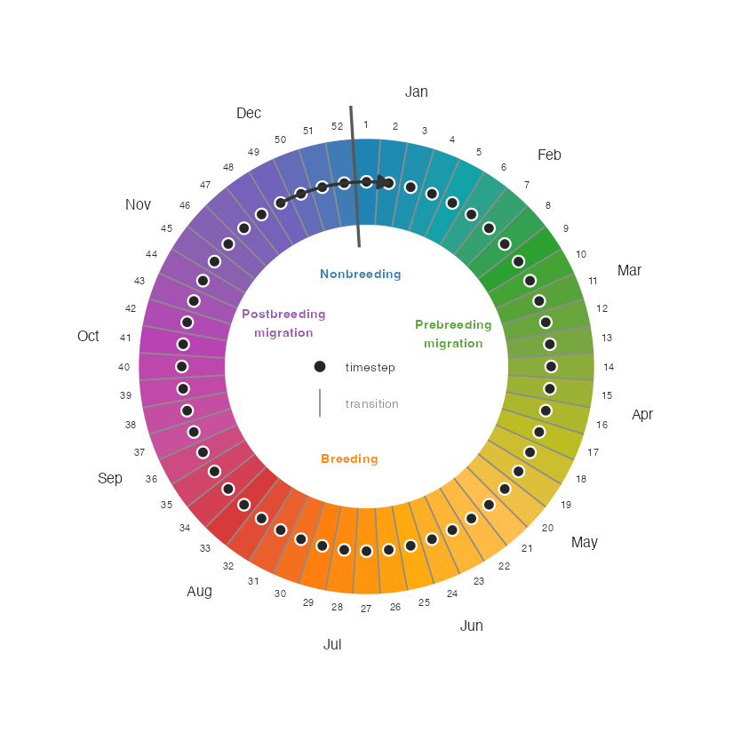

```{r, include = FALSE}
knitr::opts_chunk$set(
  collapse = TRUE,
  comment = "#>",
  out.width = "65%",
  fig.width = 6,
  fig.height = 5
)
  # Set to FALSE for efficient maintenance, testing, and deployment of the package, or
  # TRUE to use full model suitable for inference.
  use_real_model <- FALSE

```

## Setup

### Install packages
```{r install, eval = FALSE }
installed <- rownames(installed.packages())
if (!"remotes" %in% installed)
  install.packages("remotes")
if (!"rnaturalearthdata" %in% installed)
  install.packages("rnaturalearthdata")
remotes::install_github("birdflow-science/BirdFlowModels")
remotes::install_github("birdflow-science/BirdFlowR", build_vignettes = TRUE)

```

### Load libraries
```{r setup}
library(BirdFlowModels)
library(BirdFlowR)
library(terra)
library(sf)
library(ggplot2)
```


### Load model

The BirdFlow Science team has shared a
[collection of fitted models](`r paste0(birdflow_options("collection_url"), "index.html")`) for use with
the BirdFlowR package; as of mid-2026 the collection includes 60 vetted species.
The website includes reports on each species that include a visualization of the
distribution it was trained on and BirdFlow Migration Traffic Rate (BMTR) derived from the model.

A separate [Avian Influenza collection](https://birdflow-science.s3.amazonaws.com/avian_flu/index.html) 
is also available, providing models used for HPAI spread risk analysis.

We can also access the collection index through the package.

```{r load index}
# Load and print index
index <- load_collection_index()
head(index[, c("model", "species_code", "common_name")])
```

And we can load a model from the collection based on the `model` or `species` columns from
the index.
**Note:** in the vignette this block isn't executed.
```{r load model, eval = use_real_model}
# Load a specific model
bf <- load_model("amewoo") # caches locally and loads from cache
```
This loads the smaller example model instead for efficiency of package building
and testing, but do not use this one for science!
```{r load example model, eval = !use_real_model}
bf <- BirdFlowModels::amewoo # example and test dataset
```


## Quick demo

Two of the core functions of BirdFlowR are `route()` to generate synthetic migration routes and `predict()` 
to project birds forward or backward through time. 

### Routes

`route()` generates stochastic migration routes by stepping birds through the
model transitions. Calling it with a `season` argument uses species-specific
dates from eBird to set the time span.

```{r quick demo routes}
set.seed(0)
rts <- route(bf, n = 8, season = "prebreeding")
plot(rts, bf)
```

### Forecast

`predict()` propagates a starting distribution forward through time. Here we
sample a single winter location and project it forward to the breeding season.

```{r quick demo forecast}
set.seed(0)
location <- sample_distr(get_distr(bf, 1))
f <- predict(bf, distr = location, start = 1, end = 26, direction = "forward")
plot_distr(f[, c(1, 7, 14, 19)], bf, dynamic_scale = TRUE)
```


## Time

BirdFlow models represent time as a loop of 52 timesteps (eBird weeks) with an explicit link from
timestep 52 to timestep 1.

```{r time-structure-figure, echo = FALSE, out.width = "80%", fig.align = "center", fig.cap = "BirdFlow's 52-timestep circular year. Dots mark timesteps / weeks; lines between them mark transitions. Colors match the seasonal gradient used by `plot_routes()`. The bold line at the Dec/Jan boundary marks the year wrap-around. Season ranges shown are for American Woodcock."}

```

### Points in time

Most functions that operate over time — `get_distr()`, `predict()`, `route()`
— accept time in any of three forms:

- An **integer timestep** (e.g. `1`, `26`)
- A **character date** in `"YYYY-MM-DD"` format (e.g. `"2022-06-21"`)
- A **`Date` object**

`lookup_timestep()` converts a date to a timestep integer, and `lookup_date()`
does the reverse.


```{r lookup_timestep and lookup_date}
# Convert a date to a timestep
lookup_timestep("2022-06-20", bf)

# Convert a timestep back to a date
lookup_date(25, bf)

```

### Sequences through time

`predict()`, `route()`, and other functions that involve an arc through time have a common set of time
arguments that are handled by the `lookup_timestep_sequence()` helper.

There are a variety of ways to specify time for these functions:

  * `start` and `end` to specify endpoints in any of the ways outlined above: timestep integers,
    character dates e.g. `"2026-01-07"` or formal date objects.
  * `start` and `n_steps`
  * `season` and `season_buffer` — uses season start and end dates from eBird and returned by `species_info()`

With dates (formal or character) the direction in time is explicit, it will be backwards if the end date is earlier
than the start.  With all other inputs it is not explicit and defaults to forward in time.
Use `direction = "backward"` to create a sequence backwards in time with non-date input.

Here we demonstrate the time input options with `lookup_timestep_sequence()`. All of these can also be
used with `predict()` and `route()`.

```{r lookup_timestep_sequence}
# By timestep integers
lookup_timestep_sequence(bf, start = 1, end = 10)

# By character dates or formal date objects (direction is inferred from order)
lookup_timestep_sequence(bf, start = "2022-01-07", end = "2022-03-11")

# By season name (uses species-specific dates from species_info())
# and by default adds a one week buffer around the season.
lookup_timestep_sequence(bf, season = "prebreeding")

# without the buffer
lookup_timestep_sequence(bf, season = "prebreeding", season_buffer = 0)

# By start + number of steps
lookup_timestep_sequence(bf, start = 1, n_steps = 9)

# All but the date inputs can also be switched to a backward sequence
lookup_timestep_sequence(bf, season = "prebreeding", direction = "backward")

# Sequence wraps from week 52 to week 1
lookup_timestep_sequence(bf, start = 50, end = 3)
lookup_timestep_sequence(bf, start = 1, end = 45, direction = "backward")

```


## Space

### Distributions

**Distributions** are the standard format for raster data used by BirdFlow.

Each BirdFlow model has a **static mask** that defines
which cells are *active* — those with non-zero probability in at least one week
of the eBird Status and Trends data the model was trained on. Distributions
are a vector of values corresponding to the active cells in row major order.


```{r distribution-figure, echo = FALSE, out.width = "100%", fig.cap = "BirdFlow distribution data structure: the raster mask selects active cells, which are stored as a flat vector (one distribution) or matrix (multiple distributions). Cells in gray are outside of the mask and not used by BirdFlow models."}
knitr::include_graphics("DistributionDataStructures.png")
```

Qualities of distributions:

* A single distribution is a numeric vector of length `n_active(bf)`, one value per
active cell.
* Multiple distributions are stored as a matrix with `n_active(bf)` rows and one
column per timestep.
* Usually values sum to 1, and each gives the proportion of the population in the corresponding cell.
* They are model-specific: each BirdFlow model has its own extent and mask,
so a distribution from one model cannot be used with another.
* The distribution cannot represent, and the model cannot work with, data outside of the static mask.

### Spatial index conversions

The index `i` numbers active cells from 1 to `n_active(bf)`, skipping
masked-out cells (visible in the figure above as the gray shaded cells).
`i_to_xy()` and `xy_to_i()` convert between `i` and projected x/y coordinates
in the model's CRS.
`latlon_to_xy()` and `xy_to_latlon()` convert between WGS84 latitude/longitude
and the model CRS, useful for bringing in locations from outside data.

```{r spatial index conversions}
# Coordinates of the first active cell
i_to_xy(1, bf)

# Round-trip: i → xy → i
xy <- i_to_xy(100, bf)
xy_to_i(xy$x, xy$y, bf)  # should return 100

# Convert a WGS84 lat/lon to model CRS (Amherst, MA approx.)
latlon_to_xy(lat = 42.4, lon = -72.5, bf)

# Or to i index on the distribution
latlon_to_xy(lat = 42.4, lon = -72.5, bf) |> xy_to_i(bf = bf)

```

Not shown above are conversions to row and column indices.  See help for `i_to_rc()` or any of the above
functions for a complete list of spatial conversions.

### Retrieve distributions

We can retrieve the eBird distributions the model was trained on with `get_distr()`.
Use timestep, character dates, date objects, or `"all"` to specify
which distributions to retrieve.

Retrieve the first distribution and compare its length to the number of active cells.
```{r single distribution}
d <- get_distr(bf, 1) # get first timestep distribution
length(d)  # 1 distribution so d is a vector
n_active(bf)  # its length is the number of active cells in the model
```

Get 5 distributions. The result is a matrix in which each column is a distribution with a row for each active cell.
```{r multiple distributions}
d <- get_distr(bf, 26:30)
dim(d)
head(d, 3)
```

We can also specify distributions with dates, or use `"all"` to retrieve all the distributions.
```{r get_distr options}
d <- get_distr(bf, c("2022-12-15", "2022-06-15")) # from character date
d <- get_distr(bf, "all")  # all distributions (this is the default)
d <- get_distr(bf, Sys.Date())  # Using a Date object


```

Use `rasterize_distr()` to convert a distribution to a SpatRaster defined in
the terra package. The second argument, the BirdFlow model, is needed for the
spatial information it contains.  `as_distr()` converts from SpatRaster to a distribution.
```{r get distributions}
d <- get_distr(bf, c(1, 26)) # winter and summer
r <- rasterize_distr(d, bf) # convert to SpatRaster (terra package)
d2 <- as_distr(r, bf) # Convert a SpatRaster back to a distribution by default this renormalizes so each distribution sums to 1
```

Alternatively, convert directly from BirdFlow to SpatRaster with `rast()`.
The second (optional) argument `which` accepts the same inputs as `which` in `get_distr()`.

```{r rast, fig.width=8, fig.height=4, out.width='100%'}
r <- rast(bf) # all distributions
r <- rast(bf, c(1, 26))  # 1st, and 26th timesteps.
plot(r)
```

### Plot distributions

`plot_distr()` will make pretty **ggplot2** plots that handle conversion to
raster, overlaying the coastline, and by default shows the static mask.
```{r plot_distr}
get_distr(bf, species_info(bf, "prebreeding_migration_start")) |>
  plot_distr(bf=bf)
```

You can also animate over distributions.

```{r animate_distr}
get_distr(bf, lookup_timestep_sequence(bf, season = "prebreeding")) |>
  animate_distr(bf=bf)

```


## Forecasting

`predict()` is used to project any distribution into the future or past. 
It shows where birds in a particular time and location, 
or set of locations will be in the future; or were likely to have been previously.

In this example, we will sample a single starting location from the winter
distribution and project it forward to generate a distribution of
predicted breeding grounds for birds that wintered at the starting location.

Set predict parameters.
```{r predict parameters}
    start <- 1     #  winter
    end <-  26     # summer
```

### Sample starting distribution
`sample_distr()` will sample from one or more input distributions to select a
single location per distribution. The result is one or more distributions
with ones in the selected location(s) and zero elsewhere.

```{r starting location}
set.seed(0)
d <- get_distr(bf, start)
location <- sample_distr(d)

location_xy <- i_to_xy(which(as.logical(location)), bf)  # starting coordinates
print(location_xy)
```

See `as_distr()` for additional ways to create the starting distribution.

### Project forward from this location to summer

`predict()` returns the distribution over time as a matrix with
one column per timestep.

The plot shows where birds that winter at a particular location are
likely to be as the year progresses and ultimately where they might spend their
summer. The probability density spreads as the weeks progress.

```{r predict, out.width='100%'}
f <- predict(bf, distr = location, start = start, end = end,
             direction = "forward")

plot_distr(f[, c(1, 7, 14, 19)], bf)

```

A single density range is used for all four plots, and the concentrated
density at the start blows out the range.  Two options to fix this are to
let the scale be dynamic or to use a log or square root transformation.

**Dynamic scale**
```{r dynamic scale}
plot_distr(f[, c(1, 7, 14, 19)], bf, dynamic_scale = TRUE)
```

**Square root transformation**
```{r square root transformation}
plot_distr(f[, c(1, 7, 14, 19)], bf, transform = "sqrt")

```

### Manipulating distributions

Suppose we are interested in how the breeding distribution
of birds from this part of the wintering grounds differs from the
overall breeding distribution. We subtract the whole 
species distribution from the projected distribution
and plot the difference with `plot_distr()`.

```{r probability over time}
projected <- f[, ncol(f)]  # last projected distribution
diff <-  projected - get_distr(bf, end)
pal <- hcl.colors(3, palette = "Fall")

plot_distr(diff, bf, value_label = "Difference") +
    # The scale_fill_gradient2 line is optional, it adds a divergent color scheme centered on zero.
    scale_fill_gradient2(high = pal[1],mid = pal[2], low = pal[3], midpoint = 0, na.value = "transparent") +
    geom_point(aes(x = x, y = y), data = location_xy, inherit.aes = FALSE)
```


## Generating routes

Here we sample locations from the American Woodcock winter
distribution and generate routes to their summer grounds.

Set route parameters.
```{r route parameters}
n_routes <-  15 # number of routes 
start <- 1         # starting timestep (winter)
end <- 26          # ending timestep (summer)
```

### Generate starting locations

First, extract the winter distribution, then use `sample_distr()` with
`n = n_routes` to sample the input distribution repeatedly. The result is a
matrix in which each column has a single '1' representing the sampled location.
```{r starting locations}
d <- get_distr(bf, start)
locations  <- sample_distr(d, n = n_routes, bf = bf, format = "xy")
x <- locations$x
y <- locations$y
```

Plot the starting (winter) distribution and sampled locations.
```{r plot starting distribution}
plot_distr(d, bf) +
  geom_point(aes(x = x, y =y), data = locations, inherit.aes = FALSE, color = "green")
```

### Generate routes
`route()` will generate synthetic routes for each starting position.
`route()` returns a `BirdFlowRoutes` object which has a `$data` element
with a row for each timestep of each route, but also includes some additional
spatial, temporal, and species information from the `BirdFlow` object.

```{r route, fig.show='hide'}
rts <- route(bf, x_coord = x, y_coord = y, start = start, end = end)
head(rts$data, 4)
```

If locations are not provided, `route()` will sample starting locations from the starting distribution,
so the following is equivalent to the preceding two sections.

```{r route with sample}
rts2 <- route(bf,  n = n_routes,  start = start, end = end)
```

We can specify the date range with any arguments supported by
`lookup_timestep_sequence()`, so an alternative to the above with slightly
different start and end dates is to use the season argument. Here, we route
during the prebreeding migration.

```{r route with season}
rts3 <- route(bf, n = n_routes, season = "prebreeding")
```

### Plot routes

`plot()` will visualize `Routes` and `BirdFlowRoutes` objects
with time as a color gradient and stop point dots that indicate how long a
bird was at each location.

```{r plot_routes}
plot(rts3, bf)
```

Routes can also be animated.

```{r animate_routes, warning= FALSE, message = FALSE}
animate_routes(rts3, bf)
```


## Model attributes

### Basic information

`dim()`, `nrow()`, and `ncol()` all report on raster dimensions associated with the model.
`n_active` is the count of active cells — those the BirdFlow model can route birds through — a subset of all cells in the raster.
`n_transitions()` and `n_distr()` report on temporal dimensions. If the model `is_cyclical()`, they will be equal.

```{r access}
# Methods for base R functions:
dim(bf)
c(nrow(bf), ncol(bf))
bf # same as print(bf)

# BirdFlowR functions
n_active(bf)
n_transitions(bf)
n_timesteps(bf)

# Contents
has_marginals(bf)
has_distr(bf)
has_transitions(bf)
is_cyclical(bf)
```

### Species information

`species_info()` takes a BirdFlow object as the first argument.
An optional second argument allows specifying a specific item; 
if omitted, a list is returned with all available information,
all of which comes from eBird.

`species(bf)` is a shortcut for `species_info(bf, "common_name")`

Use `?species_info()` to see descriptions of all the available information.
Dates associated with migration and resident seasons are likely to be useful.


```{r BirdFlow specific info}
species(bf)
species(bf, "scientific")
species_info(bf, "prebreeding_migration_start")
si <-  species_info(bf) # list with all species information
```

### Spatial attributes

BirdFlow models have an inherent raster component and **BirdFlowR** uses the **terra** package
for raster data and provides BirdFlow methods for terra functions,
so you can use them directly on BirdFlow objects.

`crs()` returns the coordinate reference system — useful if you need to project
other data to match the BirdFlow object.
`res()`, `xres()`, and `yres()` describe the dimensions of individual cells.
`ext()` returns a terra extent object.
`compareGeom()` tests whether two objects share the same CRS, extent, and cell
size; BirdFlowR includes methods to compare BirdFlow models with each other and
with terra objects. `compareGeom()` does not check for a comparable static
mask.

```{r spatial aspects terra}
# Methods for terra functions:
a <- crs(bf) # well known text (long)
crs(bf, proj = TRUE)  # proj4 string
res(bf)
c(xres(bf), yres(bf)) # same as res(bf)
ext(bf)
c(xmin(bf), xmax(bf), ymin(bf), ymax(bf)) # same as ext(bf)

# Compare geometries - do they have the same CRS, extent, and cell size
compareGeom(bf, rast(bf))
```

BirdFlow objects also play nicely with the *sf* package.

```{r sf}
bb <- sf::st_bbox(bf)
crs <- sf::st_crs(bf)
```

### Metadata

The metadata is a mix of information from eBird and BirdFlow.
It includes the eBird version, the BirdFlowR version,
the date the model was fitted, and arguments used while creating the BirdFlow model.

```{r metadata}
md <- get_metadata(bf)  # list with all metadata
get_metadata(bf, "birdflow_model_date") # date and time the BirdFlow model was fit
get_metadata(bf, "ebird_version_year")  # eBird version year - generally a few years before the data is released
```
